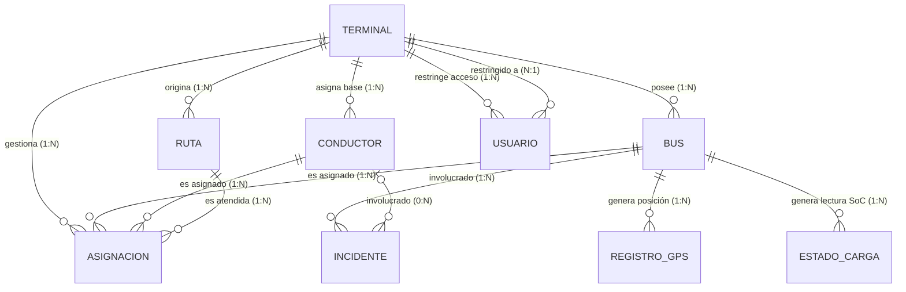
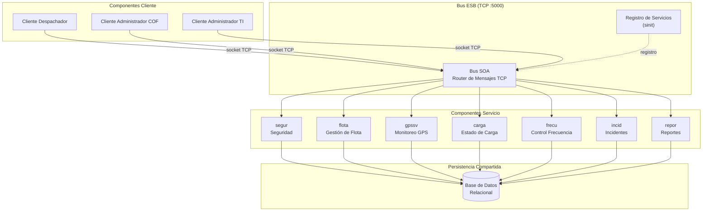
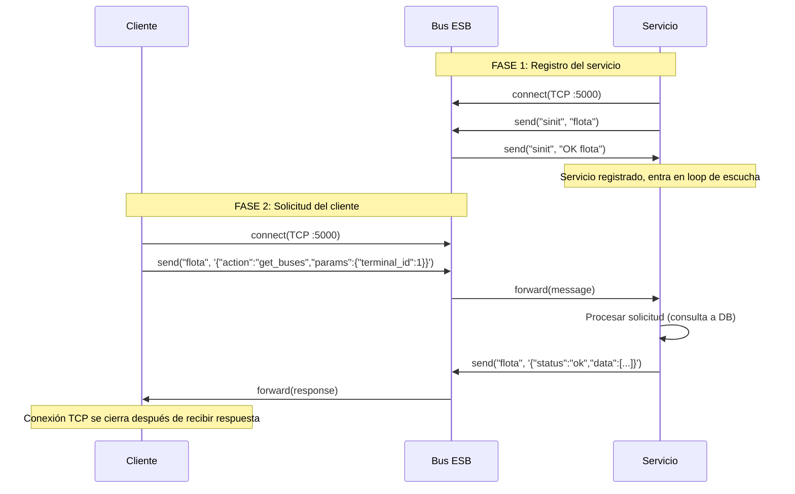

# Diseño Técnico Detallado: Persistencia, SOA y Componentes

Este documento detalla la arquitectura técnica de SICOF. Se define cómo la aplicación transita de un prototipo visual a un sistema funcional distribuido, cumpliendo los puntos 5, 6 y 7 del informe técnico.

---

## 1. Mecanismo de Persistencia y Modelo de Datos

### 1.1 Estrategia de Persistencia

SICOF utiliza una **base de datos relacional centralizada compartida entre todos los servicios**. Se eligió una estrategia de persistencia compartida (en contraste con una base independiente por servicio) por las siguientes razones:

- **Integridad referencial cruzada**: Un incidente debe referenciar un bus, un conductor y un terminal válidos. Estas relaciones cruzan dominios de múltiples servicios, lo que requiere claves foráneas verificadas a nivel de motor de base de datos.
- **Consistencia transaccional**: Operaciones como crear una asignación (bus + conductor + ruta + terminal) requieren atomicidad que se garantiza nativamente con transacciones SQL sobre una base compartida.
- **Simplificación operativa**: Con 7 servicios y un equipo de 4 personas, mantener 7 bases separadas con replicación eventual agregaría complejidad sin beneficio proporcional en esta escala.
- **Aislamiento lógico por terminal**: El control de acceso por terminal (RF-003) se implementa a nivel de consultas SQL con filtros `WHERE id_terminal = ?`, garantizando que cada despachador solo vea y opere sobre los recursos de su patio.

**Motor seleccionado**: SQLite para desarrollo local; PostgreSQL para producción (compatible sin cambios en el esquema).

**Complementos de persistencia**:

- **Datos de alta frecuencia** (GPS y SoC): Se almacenan en tablas con índices optimizados por `id_bus` y `timestamp`. En producción se recomienda TimescaleDB (extensión de PostgreSQL) para particionado automático por tiempo.
- **Evidencia multimedia**: Las fotografías adjuntas a incidentes se almacenan en sistema de archivos, con referencia en columna `url_evidencia` de la tabla `incidente`.
- **Logs de auditoría**: Registro de acciones del sistema para trazabilidad y control de acceso.

### 1.2 Modelo Entidad-Relación (ERD)

El siguiente diagrama muestra **todas las entidades del sistema**, sus **cardinalidades** y **relaciones**:



**Lectura del diagrama**:

| Relación | Cardinalidad | Significado operacional |
|---|---|---|
| Terminal → Bus | 1:N | Un terminal posee múltiples buses; cada bus pertenece a exactamente un terminal base |
| Terminal → Conductor | 1:N | Un terminal tiene múltiples conductores asignados como base operativa |
| Terminal → Ruta | 1:N | Cada ruta se origina desde un terminal específico |
| Terminal → Usuario | 1:N | Cada usuario Despachador está restringido a un terminal; Admin COF tiene `id_terminal = NULL` |
| Bus → Asignación | 1:N | Un bus puede tener múltiples asignaciones a lo largo del tiempo (una activa a la vez) |
| Conductor → Asignación | 1:N | Un conductor puede ser asignado a múltiples turnos secuenciales |
| Ruta → Asignación | 1:N | Una ruta puede ser atendida por múltiples buses en distintos turnos |
| Bus → Registro GPS | 1:N | Cada bus genera cientos de registros GPS por jornada |
| Bus → Estado Carga | 1:N | Cada bus eléctrico genera lecturas periódicas de SoC |
| Bus → Incidente | 1:N | Un bus puede estar involucrado en múltiples incidentes |
| Conductor → Incidente | 0:N | Un incidente puede o no tener conductor asociado (ej. falla mecánica en patio) |

### 1.3 Diccionario de Datos

#### Terminal
| Campo | Tipo | Restricción | Descripción |
|---|---|---|---|
| id_terminal | INT | PK, NOT NULL | Identificador único del terminal |
| nombre | VARCHAR(100) | NOT NULL | Nombre del patio (ej: El Roble) |
| direccion | VARCHAR(200) | NOT NULL | Dirección física del terminal |
| coordenada_lat | FLOAT | NOT NULL | Latitud del centro del patio |
| coordenada_lon | FLOAT | NOT NULL | Longitud del centro del patio |
| radio_geocerca | FLOAT | NOT NULL | Radio en metros de la geocerca de detección |

#### Bus
| Campo | Tipo | Restricción | Descripción |
|---|---|---|---|
| id_bus | INT | PK, NOT NULL | Identificador único del bus |
| patente | VARCHAR(10) | UNIQUE, NOT NULL | Placa del vehículo |
| tipo_energia | VARCHAR(10) | NOT NULL, CHECK | Diésel o Eléctrico |
| modelo | VARCHAR(100) | | Modelo del vehículo |
| anio_fabricacion | INT | | Año de fabricación |
| id_terminal | INT | FK → terminal, NOT NULL | Terminal base al que pertenece |
| activo | BOOLEAN | NOT NULL | Indica si el bus está operativo |

#### Conductor
| Campo | Tipo | Restricción | Descripción |
|---|---|---|---|
| id_conductor | INT | PK, NOT NULL | Identificador único del conductor |
| rut | VARCHAR(12) | UNIQUE, NOT NULL | RUT del conductor |
| nombre | VARCHAR(100) | NOT NULL | Nombre completo |
| licencia | VARCHAR(10) | NOT NULL | Número de licencia de conducir |
| id_terminal | INT | FK → terminal, NOT NULL | Terminal base asignado |
| activo | BOOLEAN | NOT NULL | Indica si el conductor está activo |

#### Ruta
| Campo | Tipo | Restricción | Descripción |
|---|---|---|---|
| id_ruta | INT | PK, NOT NULL | Identificador único de la ruta |
| codigo_recorrido | VARCHAR(20) | UNIQUE, NOT NULL | Código oficial (ej: 401, B02) |
| descripcion | TEXT | | Descripción del recorrido |
| frecuencia_min | INT | NOT NULL | Frecuencia objetivo en minutos |
| id_terminal | INT | FK → terminal, NOT NULL | Terminal de origen |

#### Asignación
| Campo | Tipo | Restricción | Descripción |
|---|---|---|---|
| id_asignacion | INT | PK, NOT NULL | Identificador único de la asignación |
| id_bus | INT | FK → bus, NOT NULL | Bus asignado |
| id_conductor | INT | FK → conductor, NOT NULL | Conductor asignado |
| id_terminal | INT | FK → terminal, NOT NULL | Terminal donde se realiza la asignación |
| id_ruta | INT | FK → ruta, NOT NULL | Ruta asignada |
| fecha_hora_inicio | TIMESTAMP | NOT NULL | Inicio de la jornada |
| fecha_hora_fin | TIMESTAMP | | Fin de la jornada (NULL si activa) |

#### Incidente
| Campo | Tipo | Restricción | Descripción |
|---|---|---|---|
| id_incidente | INT | PK, NOT NULL | Identificador único del incidente |
| id_bus | INT | FK → bus, NOT NULL | Bus involucrado |
| id_conductor | INT | FK → conductor | Conductor involucrado (nullable) |
| tipo | VARCHAR(50) | NOT NULL | Tipo: falla mecánica, accidente, vial, energía |
| severidad | VARCHAR(10) | NOT NULL, CHECK | Baja, Media, Alta, Crítica |
| descripcion | TEXT | NOT NULL | Detalle del incidente |
| coordenada_lat | FLOAT | | Latitud del lugar del incidente |
| coordenada_lon | FLOAT | | Longitud del lugar del incidente |
| url_evidencia | VARCHAR(300) | | Ruta al archivo multimedia adjunto |
| estado | VARCHAR(10) | NOT NULL, CHECK | Abierto, Escalado, Cerrado |
| fecha_hora | TIMESTAMP | NOT NULL | Fecha y hora del evento |

#### Usuario
| Campo | Tipo | Restricción | Descripción |
|---|---|---|---|
| id_usuario | INT | PK, NOT NULL | Identificador único del usuario |
| username | VARCHAR(50) | UNIQUE, NOT NULL | Nombre de usuario para login |
| password_hash | VARCHAR(255) | NOT NULL | Contraseña cifrada |
| nombre | VARCHAR(100) | NOT NULL | Nombre completo |
| rol | VARCHAR(30) | NOT NULL, CHECK | Despachador, Admin COF, Admin TI |
| id_terminal | INT | FK → terminal | Terminal asignado (NULL para Admin COF) |
| activo | BOOLEAN | NOT NULL | Estado de la cuenta |

#### Registro GPS
| Campo | Tipo | Restricción | Descripción |
|---|---|---|---|
| id_registro | BIGINT | PK, NOT NULL | Identificador único del registro |
| id_bus | INT | FK → bus, NOT NULL | Bus que generó el dato |
| coordenada_lat | FLOAT | NOT NULL | Latitud en tiempo real |
| coordenada_lon | FLOAT | NOT NULL | Longitud en tiempo real |
| velocidad_kmh | FLOAT | | Velocidad en km/h |
| timestamp | TIMESTAMP | NOT NULL | Fecha y hora exacta del registro |

#### Estado Carga (SoC)
| Campo | Tipo | Restricción | Descripción |
|---|---|---|---|
| id_estado | BIGINT | PK, NOT NULL | Identificador único del registro |
| id_bus | INT | FK → bus, NOT NULL | Bus eléctrico medido |
| nivel_carga | FLOAT | NOT NULL, CHECK 0-100 | Porcentaje de batería |
| autonomia_km | FLOAT | | Autonomía estimada en kilómetros |
| timestamp | TIMESTAMP | NOT NULL | Fecha y hora de la medición |

---

## 2. Arquitectura SOA con Bus ESB (Sockets TCP/IP)

### 2.1 Principio Arquitectónico

SICOF se diseña bajo una arquitectura orientada a servicios (SOA) donde **toda la comunicación ocurre exclusivamente mediante sockets TCP/IP nativos** a través de un **Bus de Servicios Empresariales (ESB)** centralizado. No se utiliza HTTP en ningún punto de la arquitectura de servicios.

### 2.2 Componentes del Sistema



### 2.3 Protocolo de Comunicación TCP

Todos los mensajes (solicitudes y respuestas) siguen un protocolo binario de **tres segmentos**:

```
┌──────────────────┬──────────────────┬────────────────────────┐
│  LONGITUD (5 B)  │  SERVICIO (5 B)  │  PAYLOAD (variable)    │
└──────────────────┴──────────────────┴────────────────────────┘
```

| Segmento | Tamaño | Descripción |
|---|---|---|
| **LONGITUD** | 5 bytes | Tamaño total de SERVICIO + PAYLOAD, con relleno de ceros a la izquierda (ej: `00045`) |
| **SERVICIO** | 5 bytes | Nombre del servicio destino, exactamente 5 caracteres ASCII (ej: `flota`, `segur`) |
| **PAYLOAD** | Variable | Contenido del mensaje en formato JSON codificado en UTF-8 |

**Ejemplo de solicitud** (Cliente → BUS → Servicio):
```
00058flota{"action":"get_buses","params":{"terminal_id":1}}
│     │    └─── PAYLOAD JSON (48 bytes) ───────────────────┘
│     └── SERVICIO: "flota" (5 bytes)
└── LONGITUD: 00058 (5 + 48 = 53 → "00053"... total body)
```

**Ejemplo de respuesta** (Servicio → BUS → Cliente):
```
00087flota{"status":"ok","data":[{"id_bus":1,"patente":"EB-214","tipo_energia":"Eléctrico"}]}
```

### 2.4 Estructura de Mensajes JSON

#### Formato de solicitud (Request)
```json
{
  "action": "nombre_de_la_accion",
  "params": {
    "campo1": "valor1",
    "campo2": "valor2"
  }
}
```

- `action` (string, obligatorio): Identifica la operación solicitada al servicio.
- `params` (object, opcional): Parámetros específicos de la acción.

#### Formato de respuesta exitosa
```json
{
  "status": "ok",
  "data": [ ... ],
  "count": 8
}
```

#### Formato de respuesta con error
```json
{
  "status": "error",
  "message": "Descripción legible del error"
}
```

### 2.5 Mecanismo de Interacción Cliente-Servicio

El flujo completo de una solicitud sigue estos pasos:



**Detalles clave de la interacción**:

1. **Los servicios mantienen conexión persistente**: Cada servicio se conecta al BUS una sola vez al iniciar y mantiene el socket abierto indefinidamente en un loop de lectura.
2. **Los clientes usan conexiones efímeras**: Cada solicitud del cliente abre un socket TCP nuevo, envía el mensaje, espera la respuesta y cierra la conexión.
3. **El BUS es el único punto de contacto**: Ni clientes ni servicios conocen las direcciones de los otros. Todo pasa por el BUS en el puerto 5000.
4. **Comunicación síncrona bloqueante**: El cliente queda bloqueado esperando la respuesta hasta que el servicio la devuelve a través del BUS.

### 2.6 Registro de Servicios (sinit)

Antes de poder recibir solicitudes, cada servicio debe registrarse en el BUS:

1. El servicio se conecta al BUS vía socket TCP.
2. El servicio envía un mensaje con destino `"sinit"` y payload = nombre del servicio.
3. El BUS almacena la asociación `nombre → socket` en un mapa interno.
4. El BUS responde con `"OK nombre_servicio"` confirmando el registro.

Si un servicio con el mismo nombre ya estaba registrado, el BUS cierra la conexión anterior y registra la nueva (re-registro).

### 2.7 Manejo de Errores y Fallos

El sistema maneja errores en tres niveles:

#### Errores de servicio (lógica de negocio)
Cuando una acción falla por datos inválidos o reglas de negocio:
```json
{"status": "error", "message": "Campo 'id_bus' requerido"}
```
El servicio responde con `status: "error"` y un mensaje descriptivo. El cliente interpreta el campo `status` para determinar si la operación fue exitosa.

#### Errores de comunicación (servicio no disponible)
Cuando el cliente solicita un servicio que no está registrado en el BUS:
```json
{"status": "error", "message": "Servicio 'flota' no registrado"}
```
El BUS genera esta respuesta automáticamente sin reenviar el mensaje.

#### Errores de conexión (servicio caído)
Si un servicio registrado se desconecta (crash, timeout, fallo de red):
1. El BUS detecta la desconexión al intentar reenviar el mensaje.
2. El BUS elimina el servicio del mapa de registros.
3. El BUS retorna al cliente: `{"status": "error", "message": "Servicio 'flota' no disponible"}`
4. El servicio puede reconectarse y re-registrarse cuando se recupere.

### 2.8 Sincronización y Concurrencia

#### Serialización por servicio
El BUS implementa un **lock por servicio** (mutex): cada servicio procesa **una solicitud a la vez**. Cuando llegan múltiples solicitudes simultáneas al mismo servicio:

1. La primera solicitud adquiere el lock del servicio y se reenvía al servicio.
2. Las solicitudes siguientes quedan en espera en el hilo del BUS hasta que el lock se libera.
3. Cuando el servicio responde, el lock se libera y la siguiente solicitud en cola se procesa.

Esta estrategia evita **conflictos concurrentes** y **operaciones duplicadas** a nivel de servicio, garantizando que cada servicio procesa sus solicitudes de forma serial y determinista.

#### Consistencia de datos
Al usar una base de datos relacional compartida con soporte ACID:

- **Atomicidad**: Cada operación de escritura (INSERT, UPDATE) es atómica dentro de una transacción SQL.
- **Consistencia**: Las restricciones de integridad (claves foráneas, CHECK constraints, UNIQUE) son verificadas por el motor de base de datos en cada operación.
- **Aislamiento**: SQLite usa serialización completa; PostgreSQL usa MVCC con nivel de aislamiento READ COMMITTED.
- **Durabilidad**: Los cambios son persistidos a disco antes de confirmar la transacción.

#### Prevención de operaciones duplicadas
- Cada entidad tiene un identificador único auto-incremental (PK).
- Las restricciones UNIQUE en campos como `patente` (bus) y `username` (usuario) previenen registros duplicados.
- Las asignaciones activas se identifican por `fecha_hora_fin IS NULL`, evitando duplicación de asignaciones vigentes.

---

## 3. Definición de Servicios y Contratos

### 3.1 Tabla de Servicios

| Servicio | Nombre BUS | Puerto | RF Asociados | Descripción |
|---|---|---|---|---|
| Seguridad | `segur` | TCP vía BUS | RF-003 | Autenticación, autorización, gestión de tokens JWT |
| Gestión de Flota | `flota` | TCP vía BUS | RF-001, RF-002 | CRUD de buses, conductores, asignaciones por terminal |
| Monitoreo GPS | `gpssv` | TCP vía BUS | RF-005, RF-006 | Registro de posiciones, detección de geocerca |
| Estado de Carga | `carga` | TCP vía BUS | RF-004 | Monitoreo SoC, alertas de carga insuficiente |
| Control de Frecuencia | `frecu` | TCP vía BUS | RF-007, RF-008 | Cálculo de intervalos, alertas de desviación |
| Incidentes | `incid` | TCP vía BUS | RF-009, RF-010 | Registro, escalamiento y consulta de incidentes |
| Reportes | `repor` | TCP vía BUS | RF-011, RF-012 | KPIs, reportes consolidados, exportación |

### 3.2 Contratos de Mensajes por Servicio

#### Servicio: segur (Seguridad)

| Acción | Parámetros de entrada | Respuesta exitosa | Descripción |
|---|---|---|---|
| `login` | `{"username": "cpizarro", "password": "..."}` | `{"status":"ok", "token":"eyJ...", "user":{...}}` | Autentica credenciales y retorna token JWT |
| `validate` | `{"token": "eyJ..."}` | `{"status":"ok", "user":{"id":1, "rol":"Despachador", "terminal_id":1}}` | Verifica token JWT, retorna perfil |
| `list_users` | `{"terminal_id": 1}` (opcional) | `{"status":"ok", "data":[...], "count":6}` | Lista usuarios, filtrable por terminal |

#### Servicio: flota (Gestión de Flota)

| Acción | Parámetros de entrada | Respuesta exitosa | Descripción |
|---|---|---|---|
| `get_buses` | `{"terminal_id": 1}` (opcional) | `{"status":"ok", "data":[{"id_bus":1, "patente":"EB-214", ...}], "count":8}` | Lista buses filtrados por terminal |
| `get_bus` | `{"bus_id": 1}` | `{"status":"ok", "data":{"id_bus":1, "patente":"EB-214", "soc":{...}}}` | Detalle de un bus con SoC si es eléctrico |
| `get_conductors` | `{"terminal_id": 1}` (opcional) | `{"status":"ok", "data":[...], "count":6}` | Lista conductores por terminal |
| `get_assignments` | `{"terminal_id": 1}` (opcional) | `{"status":"ok", "data":[...], "count":5}` | Asignaciones activas (sin fecha_hora_fin) |
| `create_assignment` | `{"id_bus":1, "id_conductor":1, "id_terminal":1, "id_ruta":1, "fecha_hora_inicio":"..."}` | `{"status":"ok", "id_asignacion":7}` | Crea nueva asignación |
| `get_segments` | `{"terminal_id": 1}` | `{"status":"ok", "data":[{"name":"Andén eléctrico", "buses":5, ...}]}` | Segmentos operativos del patio |
| `get_routes` | `{"terminal_id": 1}` (opcional) | `{"status":"ok", "data":[...]}` | Rutas asignadas a un terminal |
| `get_terminals` | `{}` | `{"status":"ok", "data":[{"id_terminal":1, "nombre":"El Roble", ...}]}` | Lista todos los terminales |

#### Servicio: gpssv (Monitoreo GPS)

| Acción | Parámetros de entrada | Respuesta exitosa | Descripción |
|---|---|---|---|
| `register_position` | `{"id_bus":1, "lat":-33.358, "lon":-70.734, "speed":28.5, "timestamp":"..."}` | `{"status":"ok"}` | Registra posición GPS |
| `get_position` | `{"id_bus": 1}` | `{"status":"ok", "data":{"coordenada_lat":-33.358, ...}}` | Última posición conocida |
| `get_fleet_positions` | `{"terminal_id": 1}` (opcional) | `{"status":"ok", "data":[...], "count":4}` | Posiciones de toda la flota |
| `check_geofence` | `{"id_bus": 1}` | `{"status":"ok", "inside":false, "distance_m":450.2, "radio_geocerca_m":250}` | Evalúa si bus está dentro de geocerca del terminal |

#### Servicio: carga (Estado de Carga)

| Acción | Parámetros de entrada | Respuesta exitosa | Descripción |
|---|---|---|---|
| `register_charge` | `{"id_bus":1, "nivel_carga":92.0, "autonomia_km":180, "timestamp":"..."}` | `{"status":"ok"}` | Registra lectura SoC |
| `get_charge` | `{"id_bus": 1}` | `{"status":"ok", "data":{"nivel_carga":92.0, "status_label":"Suficiente", "tone":"green"}}` | SoC actual con clasificación |
| `get_alerts` | `{"terminal_id": 1}` | `{"status":"ok", "data":[{"patente":"EB-212", "nivel_carga":35.0, "severity":"Advertencia"}]}` | Buses con carga bajo umbral (< 50%) |
| `get_charger_status` | `{"terminal_id": 1}` | `{"status":"ok", "data":[{"bay":"Cargador 1", "bus":"EB-212", "soc":"35%"}]}` | Estado de bahías de carga |
| `get_terminal_summary` | `{"terminal_id": 1}` | `{"status":"ok", "data":{"total_electric":5, "alerts":2, "critical":0}}` | Resumen energético |

#### Servicio: frecu (Control de Frecuencia)

| Acción | Parámetros de entrada | Respuesta exitosa | Descripción |
|---|---|---|---|
| `get_intervals` | `{"terminal_id": 1}` o `{"route_id": 1}` | `{"status":"ok", "data":[{"route":"406", "target_min":3, "actual_min":3.9, "severity":"Advertencia"}]}` | Intervalos actuales vs programados |
| `get_alerts` | `{"terminal_id": 1}` | `{"status":"ok", "data":[...]}` | Solo brechas que superan umbral |
| `get_corridor_status` | `{}` | `{"status":"ok", "data":[{"corridor":"US6 Troncal", "critical_routes":1}]}` | Estado agregado por corredor |

#### Servicio: incid (Incidentes)

| Acción | Parámetros de entrada | Respuesta exitosa | Descripción |
|---|---|---|---|
| `create_incident` | `{"id_bus":2, "tipo":"Energía", "severidad":"Alta", "descripcion":"...", "lat":-33.358, "lon":-70.734, "fecha_hora":"..."}` | `{"status":"ok", "id_incidente":4}` | Crea incidente con contexto operativo |
| `update_incident` | `{"id_incidente":1, "estado":"Cerrado"}` | `{"status":"ok"}` | Actualiza estado (Abierto → Escalado → Cerrado) |
| `get_incidents` | `{"terminal_id":1, "estado":"Abierto"}` (todos opcionales) | `{"status":"ok", "data":[...], "count":3}` | Lista incidentes filtrable |
| `get_incident_detail` | `{"id_incidente": 1}` | `{"status":"ok", "data":{...}}` | Detalle completo con contexto |
| `get_severity_summary` | `{"terminal_id": 1}` (opcional) | `{"status":"ok", "data":{"total":3, "alta":1, "media":2}}` | Conteo por severidad |

#### Servicio: repor (Reportes)

| Acción | Parámetros de entrada | Respuesta exitosa | Descripción |
|---|---|---|---|
| `get_operation_summary` | `{"terminal_id": 1}` (opcional) | `{"status":"ok", "data":[{"terminal":"El Roble", "compliance":95.2, ...}]}` | KPIs por terminal |
| `get_terminal_health` | `{}` | `{"status":"ok", "data":[...]}` | Salud comparativa entre terminales |
| `get_kpis` | `{}` | `{"status":"ok", "data":[{"label":"Cumplimiento", "value":"95.2%", "tone":"green"}]}` | Indicadores ejecutivos |
| `get_daily_report` | `{"terminal_id":1, "format":"json"}` | `{"status":"ok", "data":{"terminals":[...], "kpis":[...], "incidents":[...]}}` | Reporte diario consolidado |
| `get_report_catalog` | `{}` | `{"status":"ok", "data":[{"name":"Cumplimiento", "format":"PDF", "cadence":"..."}]}` | Catálogo de reportes disponibles |

---

## 4. Interfaces de Componentes y Mapeo RF/NFR

### 4.1 Componentes Cliente

#### Cliente Despachador de Terminal
- **Funcionalidad**: Gestión de buses, conductores, asignaciones, monitoreo SoC, visualización de intervalos de frecuencia y control de salidas del terminal asignado.
- **Servicios SOA consumidos**: `flota`, `carga`, `gpssv`, `frecu`, `incid` (todos vía BUS TCP).
- **RF cubiertos**: RF-001, RF-002, RF-003, RF-004, RF-005, RF-006, RF-007, RF-008, RF-009, RF-010.
- **NFR relevantes**: Tiempo de respuesta < 2 segundos; disponibilidad 99,5% en horario operativo (05:00–01:00); interfaz usable sin capacitación técnica avanzada.

#### Cliente Administrador COF
- **Funcionalidad**: Visualización global de todos los terminales, monitoreo SoC de la flota eléctrica, tablero de frecuencias consolidado, KPIs y reportes.
- **Servicios SOA consumidos**: `carga`, `frecu`, `repor`, `incid` (todos vía BUS TCP).
- **RF cubiertos**: RF-004, RF-007, RF-008, RF-009, RF-010, RF-011, RF-012.
- **NFR relevantes**: Carga del dashboard < 3 segundos con 930 buses; soporte para 20 usuarios concurrentes.

#### Cliente Administrador TI
- **Funcionalidad**: Gestión de cuentas de usuario, auditoría de accesos, configuración de parámetros operativos.
- **Servicios SOA consumidos**: `segur`, `flota` (todos vía BUS TCP).
- **RF cubiertos**: RF-003.
- **NFR relevantes**: Trazabilidad completa de acciones; seguridad de datos sensibles.

### 4.2 Trazabilidad RF → Servicio → Cliente

| RF | Descripción | Servicio SOA | Clientes |
|---|---|---|---|
| RF-001 | Registro de Flota por Terminal | `flota` | Despachador |
| RF-002 | Segmentación Operativa por Patio | `flota` | Despachador |
| RF-003 | Control de Acceso por Terminal | `segur` | Todos |
| RF-004 | Monitoreo de Carga (SoC) | `carga` | Despachador, COF |
| RF-005 | Detección de Geocerca de Salida | `gpssv` | Despachador |
| RF-006 | Registro Automático de Salida | `gpssv` | Despachador |
| RF-007 | Tablero de Intervalos en Tiempo Real | `frecu` | Despachador, COF |
| RF-008 | Alertas de Frecuencia | `frecu` | Despachador, COF |
| RF-009 | Registro de Incidentes | `incid` | Despachador, COF |
| RF-010 | Asociación de Incidentes a Contexto | `incid` | Despachador, COF |
| RF-011 | Dashboard Gerencial | `repor` | COF |
| RF-012 | Exportación de Reportes | `repor` | COF |

---

## 5. Implementación de Referencia

El código fuente que implementa esta arquitectura se encuentra en:

- **BUS ESB**: `backend/soa_bus.py` — Router de mensajes TCP en puerto 5000
- **Librería SOA**: `backend/soa_lib.py` — Funciones `connect_to_bus()`, `send_message()`, `receive_message()`
- **Servicios**: `backend/services/` — 7 servicios Python independientes
- **Base de datos**: `backend/db/schema.sql` + `backend/db/seed.sql` — Esquema y datos iniciales
- **Tests**: `backend/test_soa.py` — Validación de los 7 servicios vía BUS TCP

El sistema se levanta con un único comando:
```
python backend/start_services.py
```
