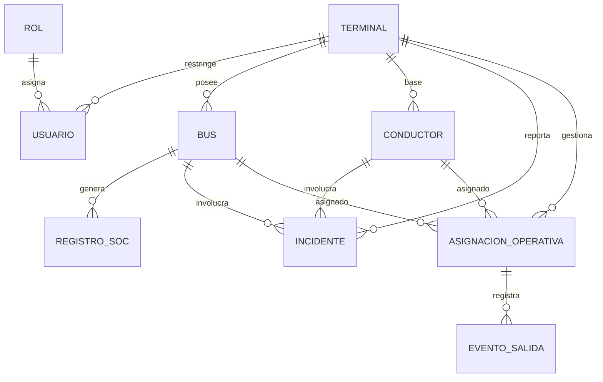
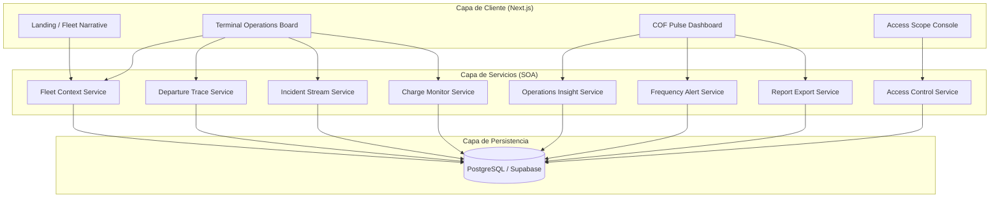

# Diseño Técnico Detallado: Persistencia, SOA y Componentes (Fase 2)

Este documento detalla la arquitectura técnica de SICOF para la Fase 2, cumpliendo con los puntos 5, 6 y 7 del informe técnico. Se define cómo la aplicación transita de un prototipo visual a un sistema funcional distribuido.

## 1. Punto 5: Mecanismo de Persistencia y Modelo de Datos

### 1.1 Estrategia de Persistencia
Se ha seleccionado una **Arquitectura Relacional con PostgreSQL** (vía Supabase) por las siguientes razones:
- **Integridad Referencial**: Crucial para asegurar que un incidente siempre esté ligado a un bus y un conductor real.
- **Seguridad a Nivel de Fila (RLS)**: Permite que el aislamiento por Terminal (NFR relevante) se maneje directamente en el motor de base de datos.
- **Escalabilidad**: Soporta el crecimiento de la flota y el historial de registros de SoC.

### 1.2 Modelo Entidad-Relación (ERD)

### 1.3 Diccionario de Datos Detallado (Extensión)

#### Tabla: `bus_locations` (Real-time tracking)
| Campo | Tipo | Restricción | Descripción |
| --- | --- | --- | --- |
| bus_id | UUID | PK, FK (buses) | ID del vehículo |
| latitude | float8 | NOT NULL | Latitud actual |
| longitude | float8 | NOT NULL | Longitud actual |
| speed | float4 | DEFAULT 0 | Velocidad en km/h |
| last_updated | timestamp | DEFAULT now() | Último reporte de GPS |

#### Tabla: `incidents` (Operational events)
| Campo | Tipo | Restricción | Descripción |
| --- | --- | --- | --- |
| id | UUID | PK | ID único del incidente |
| type | enum | 'Mecánico', 'Accidente', 'Vandalismo' | Categoría del evento |
| severity | enum | 'Baja', 'Media', 'Alta', 'Crítica' | Nivel de urgencia |
| reporter_id | UUID | FK (users) | Usuario que crea el reporte |
| status | enum | 'Abierto', 'Escalado', 'Cerrado' | Estado del flujo |

## 2. Punto 6: Estructuración SOA (Arquitectura Orientada a Servicios)

SICOF se estructura en componentes desacoplados que se comunican mediante contratos definidos.

### 2.1 Descomposición de Componentes

### 2.2 Definición de Contratos de Interfaz (API)

| Servicio | Interfaz (Contrato) | Entrada | Salida (JSON) |
| --- | --- | --- | --- |
| **FleetService** | `getFleetSnapshot(terminal_id)` | ID del Terminal | Lista de buses, posiciones y estados |
| **AuthService** | `validateAccess(user_id, scope)` | ID Usuario + Recurso | Boolean + Token de sesión |
| **EnergyService** | `getEnergyStatus(bus_id)` | ID del Bus | Nivel de SoC, autonomía y alertas |
| **DispatchService** | `recordDeparture(dispatch_id)` | ID Despacho | Confirmación + Timestamp real |

## 3. Punto 7: Mapeo de Interfaces y Requerimientos (RF/NFR)

### 3.1 Interfaces de Componentes Cliente
- **Terminal Operations Board**: Interfaz táctica de alta frecuencia.
  - **RF Cubiertos**: RF-001 (Gestión flota), RF-004 (Salidas), RF-006 (Incidentes).
  - **NFR Relevantes**: Baja latencia (< 500ms), Alta legibilidad en condiciones de patio.

- **COF Analytics Dashboard**: Interfaz de síntesis ejecutiva.
  - **RF Cubiertos**: RF-005 (Frecuencia), RF-007 (KPIs).
  - **NFR Relevantes**: Consistencia de datos multi-terminal, Capacidad de filtrado dinámico.

### 3.2 Interfaces de Componentes Servicio
- **Incident Stream Service**:
  - **Interfaz**: `POST /incidents`, `SUBSCRIBE /incidents_feed`.
  - **RF Cubiertos**: RF-006 (Alertas e incidentes).
  - **NFR Relevantes**: Integridad de la evidencia (fotos), Trazabilidad inmutable.

- **Charge Monitor Service**:
  - **Interfaz**: `GET /soc/summary`, `GET /soc/history`.
  - **RF Cubiertos**: RF-003 (Energía y SoC).
  - **NFR Relevantes**: Disponibilidad 24/7, Exactitud en la proyección de autonomía.

---
**Conclusión de Diseño**: La arquitectura propuesta garantiza que cada requerimiento funcional (RF) tiene un componente responsable y un contrato de servicio que lo sustenta, mientras que los atributos no funcionales (NFR) se manejan a través de la elección tecnológica (PostgreSQL para integridad, WebSockets para latencia).
