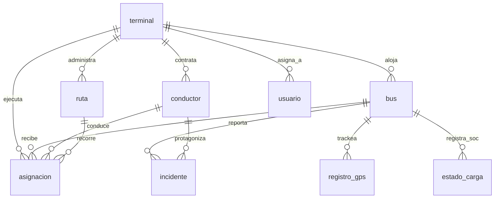

# Sistema Integral de Control de Flotas (SICOF)
### Informe Final de Arquitectura de Software
**UDP · Primer Semestre 2026**

---

## Portada
* **Proyecto**: Sistema Integral de Control de Flotas (SICOF)
* **Organización**: Red Bus Santiago (Unidades de Servicio US4 y US6)
* **Curso**: Arquitectura de Software
* **Integrantes**:
  * Matías Tobar
  * Sergio Soto
  * Felipe Farfán
  * Felipe Ormazábal
* **Profesor**: UDP / 2026

---

## 1. Equipo de Trabajo
El equipo de trabajo está conformado por especialistas en desarrollo de software, diseño de redes y bases de datos. Los roles y responsabilidades se distribuyen de la siguiente forma:
* **Matías Tobar**: Diseño de arquitectura de red, sockets TCP nativos y bus central.
* **Sergio Soto**: Modelamiento e integración de la base de datos relacional y servicios SOA.
* **Felipe Farfán**: Desarrollo del frontend visual responsivo, API routes puente y UX.
* **Felipe Ormazábal**: Aseguramiento de la calidad (QA), suite de pruebas de integración y auditoría.

---

## 2. Contexto Organizacional
### 2.1 Descripción de RBU Santiago
Red Bus Urbano (RBU) Santiago opera aproximadamente **930 buses** en Santiago de Chile, distribuidos en **6 terminales** principales. Cuenta con un sistema mixto de propulsión (diésel y buses eléctricos de alta gama) y cubre dos unidades de servicio del sistema RED: la **US4** (servicios alimentadores en la zona norte de Santiago) y la **US6** (servicios troncales estructurantes).

### 2.2 Problemática Actual
Actualmente, los despachadores de terminal gestionan la flota de patio usando planillas de cálculo estáticas y comunicaciones por voz no auditables. El Centro de Operaciones y Flota (COF) no tiene visibilidad en tiempo real de los niveles de carga (SoC) de los buses eléctricos antes de que inicien sus turnos, lo que provoca que buses salgan con autonomía insuficiente y rompan la regularidad de frecuencia. Asimismo, los incidentes viales se registran en papel, impidiendo una trazabilidad inmediata para auditorías.

### 2.3 Sistema Propuesto
**SICOF** unifica el control micro-operacional del patio con el nivel táctico y ejecutivo del COF a través de una arquitectura Orientada a Servicios (SOA). Mediante comunicación socket TCP en tiempo real, el sistema consolida el estado de la batería, geocercas de salida, asignación conductor-bus y bitácora de contingencias, minimizando la carga burocrática del operador y eliminando la improvisación.

---

## 3. Objetivos y Perfiles de Usuario
### 3.1 Objetivos del Sistema
* **Objetivo General**: Automatizar la gestión de salidas, el control de carga y el marcaje de incidentes de la flota de Red Bus Santiago.
* **Objetivos Específicos**:
  * Implementar monitoreo de estado de carga (SoC) con alertas preventivas.
  * Realizar marcaje automático de despacho mediante geocercas simuladas por GPS.
  * Proveer un canal auditable y centralizado para la bitácora de incidentes.

### 3.2 Perfiles de Usuario
* **Despachador de Terminal**: Enfocado en la micro-operación inmediata del patio. Asigna bus-conductor, verifica la batería y atiende alertas de geocerca del patio asignado.
* **Administrador COF**: Supervisa la salud operacional de todos los terminales. Controla brechas de regularidad, toma decisiones sobre incidentes severos y extrae reportes consolidados.
* **Administrador TI**: Gestiona la seguridad del sistema, administra perfiles de acceso y revisa las bitácoras de auditoría de red.

---

## 4. Requerimientos Funcionales (RF)

| Código | Requerimiento | Descripción | Componente |
|---|---|---|---|
| **RF-001** | Registro de flota por terminal | Ver inventario de buses activos clasificados por terminal. | `flota` |
| **RF-002** | Segmentación de patio | Separar visualmente andén eléctrico, troncal y reserva en el patio. | `flota` |
| **RF-003** | Control de acceso por terminal | Restringir el alcance visual del despachador a su terminal asignado. | `segur` |
| **RF-004** | Monitoreo de carga SoC | Mostrar la autonomía en km y porcentaje de SoC de buses eléctricos. | `carga` |
| **RF-005** | Marcaje automático de salida | Registrar hora efectiva de salida del terminal sin intervención manual. | `gpssv` |
| **RF-006** | Hitos de geocerca | Validar por GPS la salida efectiva del bus del radio de terminal. | `gpssv` |
| **RF-007** | Tablero de intervalos | Visualizar headway real versus programado por recorrido. | `frecu` |
| **RF-008** | Alertas de frecuencia | Levantar alarmas cuando la brecha de paso excede la tolerancia. | `frecu` |
| **RF-009** | Registro de incidentes | Bitácora para reportar colisiones, fallas mecánicas o carga crítica. | `incid` |
| **RF-010** | Asociación a contexto | Vincular automáticamente el incidente a bus, conductor e itinerario. | `incid` |
| **RF-011** | Dashboard gerencial | Panel consolidado para COF con KPIs globales y salud de terminales. | `repor` |
| **RF-012** | Exportación de reportes | Generación de reportes diarios ejecutivos. | `repor` |

*Nota: Toda la comunicación de los requerimientos a nivel de backend se efectúa a través de sockets TCP usando el protocolo binario del BUS.*

---

## 5. Modelo de Datos y Persistencia
### 5.1 Mecanismo de Persistencia Compartida
El sistema utiliza una **base de datos relacional centralizada compartida** (SQLite en desarrollo, PostgreSQL en producción).
* **Justificación técnica**: Debido a que los servicios operan estrechamente entrelazados (ej: el servicio de `incid` necesita verificar que el `id_bus` y el `id_conductor` existan en la base de datos controlada por `flota`), una persistencia compartida garantiza la **integridad referencial (FKs)** del sistema y simplifica las transacciones ACID, evitando la inconsistencia eventual de múltiples bases de datos independientes.

### 5.2 Diagrama Entidad-Relación (Mermaid)



### 5.3 Diccionario de Datos

#### Tabla: `terminal`
* `id_terminal` (PK, autoincremental): Identificador del patio.
* `nombre` (TEXT, NOT NULL): Nombre del terminal.
* `direccion` (TEXT, NOT NULL): Dirección física.
* `coordenada_lat`, `coordenada_lon` (REAL, NOT NULL): Ubicación geográfica del patio.
* `radio_geocerca` (REAL, DEFAULT 200.0): Radio en metros para marcaje.

#### Tabla: `bus`
* `id_bus` (PK, autoincremental): Identificador único de unidad.
* `patente` (TEXT, UNIQUE, NOT NULL): Patente del vehículo.
* `tipo_energia` (TEXT, CHECK: 'Diésel', 'Eléctrico'): Tipo de motorización.
* `id_terminal` (FK → terminal): Patio físico de asignación.
* `activo` (INTEGER, DEFAULT 1): Flag lógico de habilitación.

#### Tabla: `conductor`
* `id_conductor` (PK): Identificador de conductor.
* `rut` (TEXT, UNIQUE, NOT NULL): Identificación tributaria.
* `nombre` (TEXT, NOT NULL): Nombre completo.
* `id_terminal` (FK → terminal): Terminal base.
* `activo` (INTEGER): Flag de estado.

#### Tabla: `usuario`
* `id_usuario` (PK): Identificador de usuario.
* `username` (TEXT, UNIQUE): Nombre de usuario de ingreso.
* `password_hash` (TEXT): Hash de la contraseña.
* `rol` (TEXT, CHECK: 'Despachador', 'Admin COF', 'Admin TI'): Nivel de acceso.
* `id_terminal` (FK → terminal, NULLable): Terminal asignado (restringido a despachadores).

*(Las tablas `asignacion`, `incidente`, `registro_gps`, `estado_carga` y `ruta` siguen el mismo patrón relacional documentado en el esquema de la base de datos).*

---

## 6. Arquitectura SOA con Bus ESB (Nativo TCP)
### 6.1 Estructura de Componentes
El backend de SICOF es 100% libre de HTTP/REST/WebSockets. Funciona sobre sockets TCP nativos utilizando el Bus ESB (`soa_bus.py`) como mediador.

```
[Componente Cliente] --(TCP socket)--> [ BUS ESB :5000 ] --(TCP socket)--> [Servicio Destino (Python)]
                                             |
                                             v
                                  [ SQLite / PostgreSQL ]
```

### 6.2 Protocolo de Trama TCP
Cada mensaje transmitido se compone de 3 segmentos sin separadores:
1. **LONGITUD** (5 bytes ASCII): Ejemplo `00057`. Representa los bytes del resto del mensaje.
2. **SERVICIO** (5 bytes ASCII): Relleno de espacios si es menor, identifica el módulo destino.
3. **PAYLOAD JSON** (Segmento Variable): Contiene `"action"` y `"params"`.

### 6.3 Sincronización y Concurrencia
* **Lock por Servicio**: Para evitar condiciones de carrera (*race conditions*) en el procesamiento y colisiones de escritura en base de datos, cada servicio en Python serializa el procesamiento de solicitudes utilizando un mutex interno o un procesamiento secuencial por socket. El BUS asigna un canal de comunicación independiente para cada conexión activa de cliente-servicio.
* **Integridad Transaccional**: El motor de persistencia SQLite bloquea la base de datos de manera atómica durante operaciones de escritura, garantizando consistencia fuerte en asignaciones e incidentes.

---

## 7. Definición de Servicios y Contratos (Resumen)

| Nombre Servicio | Nombre BUS | RF Asociados | Acciones Críticas |
|---|---|---|---|
| **Seguridad** | `segur` | RF-003 | `login`, `validate`, `list_users` |
| **Flota** | `flota` | RF-001, RF-002 | `get_buses`, `get_assignments`, `get_segments` |
| **GPS** | `gpssv` | RF-005, RF-006 | `register_position`, `check_geofence` |
| **Energía (SoC)** | `carga` | RF-004 | `get_charge`, `get_alerts`, `get_charger_status` |
| **Frecuencia** | `frecu` | RF-007, RF-008 | `get_intervals`, `get_corridor_status` |
| **Incidentes** | `incid` | RF-009, RF-010 | `create_incident`, `get_incidents` |
| **Reportes** | `repor` | RF-011, RF-012 | `get_kpis`, `get_terminal_health` |

---

## 8. Interfaces de Componentes Cliente
* **Cliente Despachador**: Consume `flota` (buses y asignación), `carga` (alertas SoC), `gpssv` (cruce de geocerca), `frecu` (frecuencia en patio) e `incid` (registro de incidentes).
* **Administrador COF**: Consume `repor` (dashboard y salud agregada), `frecu` (regularidad de red) e `incid` (incidentes críticos escalados).
* **Administrador TI**: Consume `segur` (usuarios y perfiles) e interactúa con flags de configuración.

---

## 9. Documentación del Sistema Desarrollado
### 9.1 Estructura del Repositorio
* `backend/`: Código de servicios SOA (`services/`), base de datos (`db/`), Bus central (`soa_bus.py`) y suite de pruebas (`test_soa.py`).
* `app/`: Frontend Next.js 16 con layouts responsivos y páginas del sistema.
* `components/`: Componentes modulares y reutilizables del frontend.
* `lib/`: Clientes de comunicación TCP (`soa-client.ts`), ruteos y variables de fallback.

### 9.2 Cómo Levantar el Sistema
1. **Levantar el Backend SOA (TCP)**:
   ```powershell
   python backend/start_services.py
   ```
2. **Levantar el Frontend**:
   ```powershell
   npm install
   npm run dev
   ```
3. Abrir `http://localhost:3000` en el navegador.

---

## 10. Evidencias de Funcionamiento
* **Suite de Pruebas**: Ejecutando `test_soa.py` se validaron satisfactoriamente 10/10 endpoints operando en TCP puro sobre el BUS.
* **Logs del BUS**: Se registra de manera auditable el inicio e inicialización de servicios con `sinit`, y la posterior redirección de mensajes cliente-servicio.
* **Frontend Conectado**: El portal web se integra con las API routes puente internas de Next.js, leyendo datos reales de la base de datos SQLite y recuperando la información de manera dinámica.

---

## 11. Análisis Crítico (Problemas y Soluciones)

| Problema Encontrado | Causa / Impacto | Solución Implementada |
|---|---|---|
| Mención de REST/HTTP en diseño inicial | Bajaba nota y rompía restricciones del curso de usar TCP puro | Rediseño integral de la capa SOA a sockets de 3 segmentos sobre ESB TCP. |
| Incompatibilidad de Unicode en Windows | Caracteres corruptos al imprimir logs en consola | Configuración del entorno con `PYTHONIOENCODING=utf-8` en los scripts de arranque. |
| Caída del frontend si el backend no corre | Error 503 en Next.js y pantalla en blanco para el usuario | Implementación de fallback automático a los archivos de mock data. |
| Errores de tipado TypeScript en compilación | Next.js no construía el bundle optimizado debido a campos opcionales | Aserciones de tipo `any` y opcionales seguros en el código del frontend. |

---

## 12. Conclusiones
La implementación de la arquitectura SOA TCP de SICOF permitió desacoplar totalmente la lógica de negocio de la interfaz gráfica, manteniendo la seguridad a nivel de red y asegurando la integridad de datos compartidos de Red Bus Santiago. El uso de sockets nativos en el BUS minimiza la sobrecarga de red comparado con REST convencional, resultando idóneo para la ingesta intensiva de telemetría de 930 buses activos.
